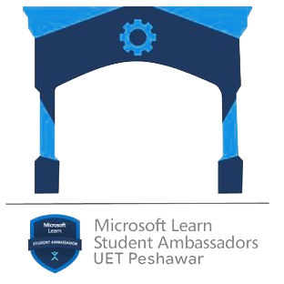

# Machine Learning with Python Scikit Learn and VSCode

Machine learning (ML) is a type of artificial intelligence (AI) that allows software applications to become more accurate at predicting outcomes without being explicitly programmed to do so

###  End to End Machine Learning Project

This notebook will introduce some foundation machine learning and data science concepts by exploring the problem of Titanic Data classification. It is intended to be an end-to-end example of what a data science and machine learning proof of concept might look like.

### What is classification?
Classification involves deciding whether a sample is part of one class or another (single-class classification). If there are multiple class options, it's referred to as multi-class classification.
example might be to decide if an image is of a cat or a dog.


### What we will look into?
* **Exploratory data analysis (EDA)** - the process of going through a dataset and finding out more about it.
* **Model training** - create model(s) to learn to predict a target variable based on other variables.
* **Model evaluation** - evaluating a models predictions using problem-specific evaluation metrics. 
* **Model comparison** - comparing several different models to find the best one.
* **Model fine-tuning** - once we've found a good model, how can we improve it?
* **Reporting what we've found** - if we had to present our work, what would we show someone?

### What we will use?
To work through these topics, we'll use pandas, Matplotlib and NumPy for data anaylsis, as well as, Scikit-Learn for machine learning and modelling tasks.

## Lets get started!

First of all we need to create an anaconda environment and install the necessary packages. 
Simply run the following command in the terminal:


```conda create --prefix ./env pandas numpy matplotlib scikit-learn jupyter```


Now Activate the enviroment and get started!


```conda activate ./env```


## What is our data
We have taken our dataset from **Titanic - Machine Learning from Disaster** which is available on kaggle at [https://www.kaggle.com/competitions/titanic](https://www.kaggle.com/competitions/titanic)

### Goal 
It is our job to predict if a passenger survived the sinking of the Titanic or not. For each in the test set, you must predict a 0 or 1 value for the variable.

### Problem Definition
In our case, the problem we will be exploring is **binary classification** (a sample can only be one of two things). This is because we're going to be using a number of differnet **features** (pieces of information) about a person to predict whether they have survivied or not

### Data Dictionary
```
|Variable       |Definition                                        |Key                                           |
|---------------|--------------------------------------------------|----------------------------------------------|
|survival       |Survival                                          |0 = No, 1 = Yes                               |
|pclass         |Ticket class                                      |1 = 1st, 2 = 2nd, 3 = 3rd                     |
|sex            |Sex                                               |                                              |
|Age            |Age in years                                      |                                              |
|sibsp          |# of siblings / spouses aboard the Titanic        |                                              |
|parch          |# of parents / children aboard the Titanic        |                                              |
|ticket         |Ticket number                                     |                                              |
|fare           |Passenger fare                                    |                                              |
|cabin          |Cabin number                                      |                                              |
|embarked       |Port of Embarkation                               |C = Cherbourg, Q = Queenstown, S = Southampton|
```


## NoteBook Credits and Citations

This notebook has been created by **Alpha MLSA Hamas ur Rehman** student at UET Peshawar
 
 


Dataset was downloaded from [kaggle](https://www.kaggle.com/)

Images used from
- miro.medium
- Scikit-Learn
- zerotomastery.io

Content inspiration from **Andrei Neagoie & Daniel Bourke** course called [Complete Machine Learning and Data Science Bootcamp](https://zerotomastery.io/courses/machine-learning-and-data-science-bootcamp/)


